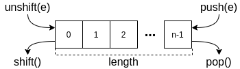

# Efficient JavaScript Queues with Array Interface

JavaScript Array is a convenient data structure.
The size of the array is flexible.
So you don't need to specify the array size initially.
Moreover, we can use it as a stack, queue, and DEQue (double-ended queue).
The following diagram summarizes the related methods and properties:

When we use a JavaScript array as a queue,
we use `push` to insert an item to the queue,
`shift` to get an item from the queue.
We can also check if the queue is empty or not
by checking if the `length` is zero or not.

This project uses the above APIs to implement a queue.

## `queue`: Asymptotically Efficient Queue
The `shift` operation of JavaScript is slower than `pop` operation
since it requires rearrangement of the array.
When we talk about time complexity,
the `shift` operation of JavaScript is known to take *O*(*n*) time
while `push` or `pop` operation takes *O*(1) time.
This makes the queue implementation using JavaScript array impractical
while the stack implementation is efficient and practical.

The `shift` operation of `queue.js` takes asymptotically *O*(1) Time-Complexity.

### Alternatives
* [deque](https://github.com/petkaantonov/deque) by Petka Antonov
  - Efficient Deque implementation with initial size
  - Circular buffer